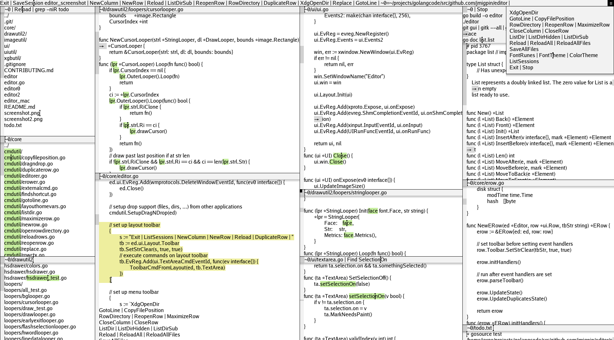
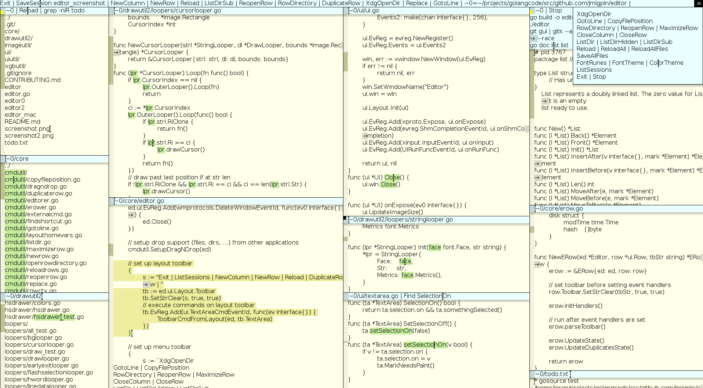

# Editor

Source code editor in pure Go.





- This is a know-what-you're-doing source code editor
- As the editor is being developed, the rules of how the UI interacts will become more well defined.

### Features

- Auto indentation of wrapped lines.
- No code coloring.
- Many TextArea utilities: undo/redo, replace, comment, ...
- Start external processes from the toolbar with a click, capturing the output to a row. 
- Drag and drop files/directories to the editor.
- Detects if files opened are changed outside of the editor.
- Calls goimports if available when saving a .go file.
- Clicking on `.go` files identifiers will jump to the identifier definition (Ex: a function definition).

### Installation and usage

```
go get -u github.com/jmigpin/editor
cd $GOPATH/src/github.com/jmigpin/editor
go build 
./editor
```

```
./editor --help
Usage of ./editor:
  -colortheme string
    	available: light, dark, acme (default "light")
  -cpuprofile string
    	profile cpu filename
  -dpi float
    	monitor dots per inch (default 72)
  -font string
    	ttf font filename or: regular, medium, mono (default "regular")
  -fontsize float
    	 (default 12)
  -scrollbarleft
    	set scrollbars on the left side (default true)
  -scrollbarwidth int
    	textarea scrollbar width (default 12)
  -sessionname string
    	open existing session
  -shadows
    	shadow effects on some elements (default true)
  -tabwidth int
    	 (default 8)
  -wraplinerune int
    	code for wrap line rune, can be set to zero (default 8594)
```

### Basic Layout

The editor has a top toolbar and columns. Columns have rows. Rows have a square-button, a toolbar and a textarea.

These toolbars are textareas where clicking on the text will run that text as a command.

The square-button shows the state of the row.

### Row square-button states

- background colors:
  - `blue`: row file has been edited.
  - `orange`: row file doesn't exist.
- dot colors:
  - `black`: row currently active. There is only one active row.
  - `red`: row file was edited outside (changed on disk) and doesn't match last known save. You can run `Reload` to get the disk version.
  - `blue`: row is duplicated (2 or more). 
  - `yellow`: there are other rows with same filename (2 or more). Color will change when the pointer is over one of the rows.

### key/button shortcuts

#### Global key/button shortcuts

- `f1`: toggle context float box (__experimental__)
  - does auto-completion for `.go` files. (__experimental__)

#### Column key/button shortcuts

- `buttonLeft`:
  - on left border: drag to move/resize
  - on square-button: close

#### Row key/button shortcuts

- `ctrl`+`s`: save file
- `ctrl`+`f`: warp pointer to "Find" cmd in row toolbar
- `buttonLeft` on square-button: close row
- on top border:
  - `buttonLeft`: drag to move/resize row
  - `buttonMiddle`: close row
  - `buttonWheelUp`: adjust row vertical position, pushing other rows up
  - `buttonWheelDown`: adjust row vertical position, pushing other rows down
- Any button/key press: make row active to layout toolbar commands

#### Textarea key/button shortcuts

- `left`: move cursor left
- `right`: move cursor right
- `up`: move cursor up
- `down`: move cursor down
- `home`: start of line
- `end`: end of line
- `delete`: delete current rune
- `backspace`: delete previous rune
- `pageUp`: page up
- `pageDown`: page down
- `tab` (if selection is on): insert tab at beginning of lines
- `shift`+`left`: move cursor left adding to selection
- `shift`+`right`: move cursor right adding to selection
- `shift`+`up`: move cursor up adding to selection
- `shift`+`down`: move cursor down adding to selection
- `shift`+`home`: start of string adding to selection
- `shift`+`end`: end of string adding to selection
- `shift`+`tab`: remove tab from beginning of line
- `ctrl`+`a`: select all
- `ctrl`+`c`: copy to clipboard
- `ctrl`+`d`: comment lines
- `ctrl`+`k`: remove lines
- `ctrl`+`v`: paste from clipboard
- `ctrl`+`x`: cut
- `ctrl`+`z`: undo
- `ctrl`+`alt`+`down`: move line down
- `ctrl`+`alt`+`shift`+`down`: duplicate lines
- `ctrl`+`shift`+`z`: redo
- `ctrl`+`shift`+`d`: uncomment lines
- `buttonLeft`: move cursor to point
  - drag: selects text - works as copy making it available for paste (primary selection).
- `buttonMiddle`: paste from primary
- `buttonRight`: move cursor to point + text area cmd
- `buttonWheelUp`: scroll up
- `buttonWheelDown`: scroll down
- `buttonWheelUp` on scrollbar: page up
- `buttonWheelDown` on scrollbar: page down
- `shift`+`buttonLeft`: move cursor to point adding to selection

### Commands

#### Layout toolbar commands (top toolbar)

- `ListSessions`: lists saved sessions
- `SaveSession <name>`: save session to ~/.editor_sessions.json
- `DeleteSession <name>`: deletes the session from the sessions file
- `NewColumn`: opens new column
- `NewRow`: opens new empty row located at the active-row directory, or if there is none, the current directory. Useful to run commands in a directory.
- `ReopenRow`: reopen a previously closed row
- `SaveAllFiles`: saves all files
- `ReloadAll`: reloads all filepaths
- `ReloadAllFiles`: reloads all filepaths that are files
- `ColorTheme`: cycles through available color themes.
- `FontTheme`: cycles through available font themes.
- `Exit`: exits the program

#### Row toolbar commands

These commands run on a row toolbar, or on the top toolbar with the active-row.

- `Save`: save file
- `Reload`: reload content
- `CloseRow`: close row
- `CloseColumn`: closes row column
- `Find`: find string (ignores case)
- `GotoLine <num>`: goes to line number
- `Replace <old> <new>`: replaces old string with new, respects selections
- `Stop`: stops current process (external cmd) running in the row
- `ListDir`: lists directory
- `ListDirSub`: lists directory and sub directories
- `ListDirHidden`: lists directory including hidden
- `MaximizeRow`: maximize row. Will push other rows up/down.
- `RowDirectory`: get the row directory and go to the row that has it, if it doesn't exist, create a new row with the directory listing under the active-row. Useful when editing a file and want to access the file directory content.
- `DuplicateRow`: make row share the edit history with a new row that updates when changes are made.
- `CopyFilePosition`: copy to clipboard the cursor file position in the format "file:line:col". Useful to paste a clickable text with the file position.
- `XdgOpenDir`: calls xdg-open to open the row directory with the preferred external application (ex: a filemanager).
- toolbar first part (usually the row filename): clicking on a section of the path of the filename will open a new row (possibly duplicate) with that content. Ex: if a row filename is "/a/b/c.txt" clicking on "/a" will open a new row with that directory listing, while clicking on "/a/b/c.txt" will open a duplicate of that file.

#### Textarea commands

- `OpenSession <name>`: opens previously saved session
- `<url>`: opens url in x-www-browser
- `<directory>`: opens directory
- `<filename:number?:number?>`: opens filename, possibly at line/column (usual output from compilers)
- `<quoted-string>`: opens filepath if existent. Checks for common locations like `$GOROOT` and C include directories.
- `<identifier-in-a-.go-file>`: opens definition of the identifier. Ex: clicking in `Println` on `fmt.Println` will open the file at the line that contains the `Println` function definition.

### Notes

- Uses X shared memory extension (MIT-SHM). 
- MacOS might need to have XQuartz installed.
- Notable projects that inspired many features:
  - Oberon OS: https://www.youtube.com/watch?v=UTIJaKO0iqU 
  - Acme editor: https://www.youtube.com/watch?v=dP1xVpMPn8M 

